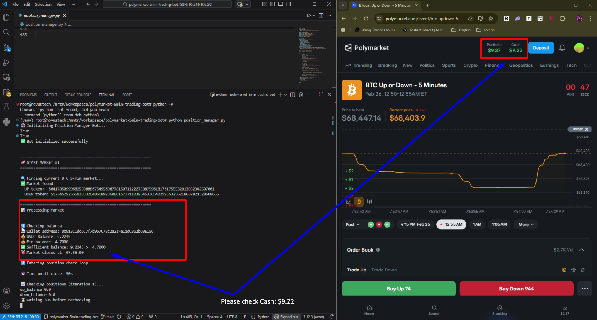
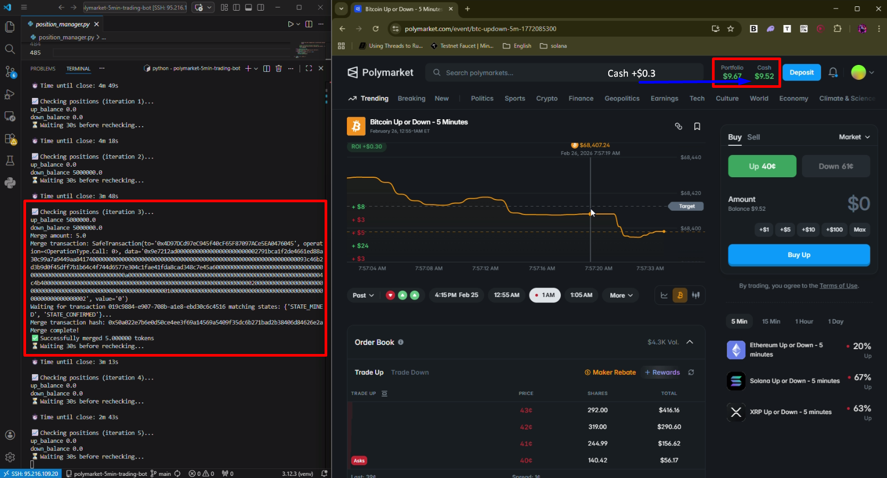
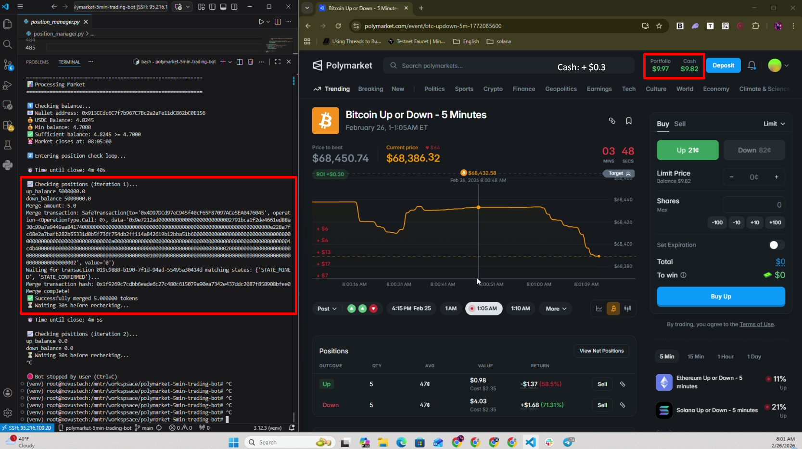
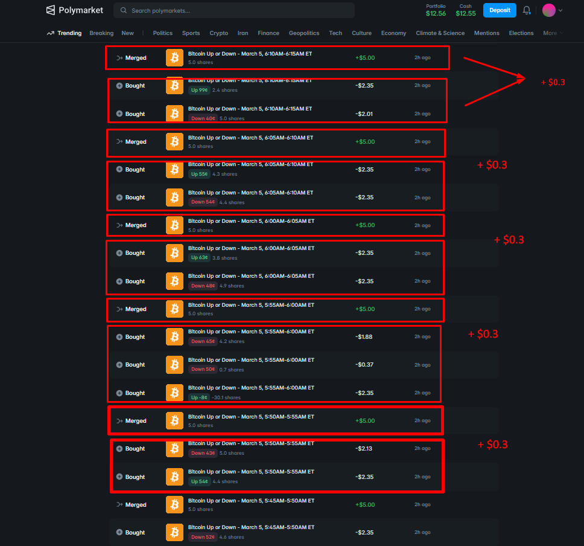
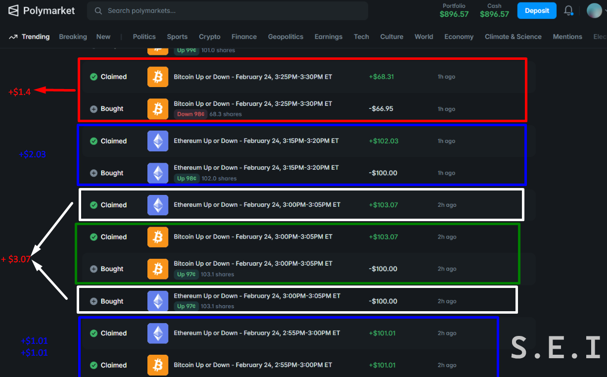

# Polymarket BTC 5-Minute Trading Bot

**📞 Contact:** [S.E.I](https://t.me/sei_dev) (Telegram)

---

🤖 Automated trading bot for Polymarket BTC 5-minute up/down markets. Trade 24/7 with two strategies:

| Strategy | Description | Bot |
|----------|-------------|-----|
| **Strategy 1** | Arbitrage at the middle of the market | [@sei_arb_bot](https://t.me/sei_arb_bot) (~30 min) |
| **Strategy 2** | High-opportunity trading at end of market cycle | [@seitrading_bot](https://t.me/seitrading_bot) (~1 hour) |

📹 **Lets see video** [Watch on YouTube](https://www.youtube.com/watch?v=teeMT-c4S3o)

---

## Strategy 1: Arbitrage (mid-market)

Buy both sides, merge to recover USDC. **Try in ~30 min:** [@sei_arb_bot](https://t.me/sei_arb_bot)
📹 **Guide Demo:** [Watch on YouTube](https://www.youtube.com/watch?v=NsRDKPQrRIs)
### Screenshots

|  |  |  |
|--|--|--|
|  |  |  |

| Result |
|--------|
|  |

### Features

- 🔍 Auto Market Discovery – Finds active BTC 5-minute markets
- 📊 Smart Position Management – Monitors UP/DOWN positions
- 🛡️ Risk Protection – Auto-sells before market close
- 💰 Token Merging – Recovers USDC from equal positions

### How It Works

1. Finds the current BTC 5-minute market  
2. Monitors UP/DOWN token positions  
3. Merges equal positions to recover USDC  
4. Force-sells before market close (30s threshold)  
5. Places orders for the next market automatically  

---

## Strategy 2: End-of-cycle trading

High-opportunity trading at the end of the market cycle. **Try in ~1 hour:** [@seitrading_bot](https://t.me/seitrading_bot)

### Screenshots

| Result 1 |
|----------|
| 
### Features

- High-opportunity detection at end of market cycle
- Automated timing and order placement
- Risk-managed exposure

### How It Works

1. Monitors the current 5-minute market toward resolution  
2. Identifies high-opportunity moments at end of cycle  
3. Places or adjusts orders accordingly  
4. Manages positions and exits before market close  

---

## 🚀 Quick Start

1. **Install dependencies:**
   ```bash
   pip install -r requirements.txt
   ```

2. **Configure `.env`:**
   ```bash
   PRIVATE_KEY=0x...    # Your wallet private key
   ORDER_PRICE=0.46     # Limit order price
   ORDER_SIZE=5.0       # Order size
   ```

3. **Run the bot:**
   ```bash
   python main.py
   ```

---

## 📚 Documentation

- **User guide:** [docs.md](docs.md) – How to use the TG bot and get started.
